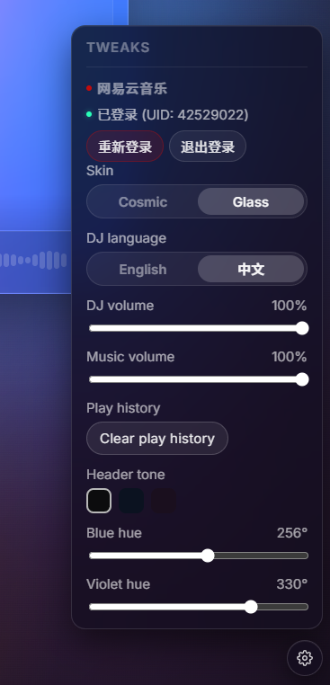
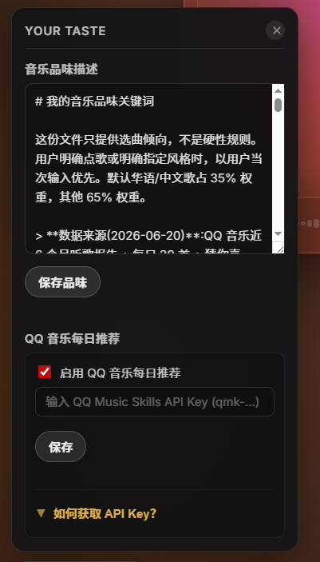

# Claudio FM

**Claudio FM is a private AI radio station.**

> **Attribution / 致谢**
>
> This project is a fork / downstream of
> [**bingyanglu/Claudio-FM**](https://github.com/bingyanglu/Claudio-FM). The
> first eight commits (and most of the original design) come from that repo.
> If you are looking for the upstream project, please head there first.
>
> 本项目 fork 自 [**bingyanglu/Claudio-FM**](https://github.com/bingyanglu/Claudio-FM),
> 前 8 个 commit 与主要设计来自该上游仓库。原始项目请前往该链接。
>
> Recent changes in this fork (cookie trim, clear-play-history, heart/favorite
> button, 鸡汤妹 Chinese voice preset, startup ordering, bridge reliability
> fixes, deployment hardening) are listed in [Recent Updates](#recent-updates)
> / [最近更新](#最近更新) below.

It acts like a real DJ: it chooses music, speaks on air, bridges between songs, and keeps the station going based on your taste and the current moment.

Claudio is not a playlist generator or a chatbot that waits for commands. Open it, press play, and it begins programming a small radio show for you. It reads the hour, remembers your recent listening, follows your music taste, and turns each DJ line into spoken audio before the next song comes in.

## Preview


## What It Feels Like

Claudio is for moments when you do not want to build a playlist.

You might be working, cooking, resting, or just letting the afternoon pass. Claudio listens to the shape of that moment and creates a short set: a few songs, a warm opening, a bridge between tracks, and sometimes silence when the music should speak for itself.

You can also call into the station through the request line. Claudio can play a caller-style voice moment, take your message as a signal, adjust the mood, and keep the broadcast moving.

## What Claudio Does

- Chooses songs based on your taste and the current time.
- Opens a set with DJ narration.
- Takes listener calls through the request line.
- Speaks in short, separate radio segments.
- Bridges between songs like a live host.
- Turns DJ lines into voice with TTS.
- Keeps music buffered so the station can continue.
- Lets you choose whether the DJ speaks English or Chinese.
- Lets you control DJ voice volume and music volume separately.

## Why It Is Different

Most music apps help you find tracks.

Claudio tries to make the music feel hosted.

The important part is not just recommendation. It is the feeling that someone is running the station: choosing what fits, saying only what helps, leaving space when needed, and carrying one song into the next.

## Inspiration

The creative inspiration for Claudio FM came from the Douyin creator **mmguo**.

## Running Locally

Claudio FM relies on a sibling project for streaming music from Netease:

**`NeteaseCloudMusicApi`** — a Node.js service that exposes the Netease
Web/Cloud API over HTTP on port `3000`. This repo does **not** vendor it; you
need to place it next to `claudio-fm/`:

```bash
# from the parent directory that will hold both projects
git clone https://github.com/Binaryify/NeteaseCloudMusicApi.git
cd NeteaseCloudMusicApi && npm install && cd ..
```

The expected layout is:

```text
parent-dir/
├── claudio-fm/                 # this repo
└── NeteaseCloudMusicApi/       # the sidecar cloned above
    └── node_modules/...
```

`scripts/start.js` looks for `../NeteaseCloudMusicApi/node_modules/NeteaseCloudMusicApi/app.js`
first, waits for its `/inner/version` endpoint, then launches Claudio. If the
sidecar is not present, it falls back to `npx NeteaseCloudMusicApi@latest`
(requires `npx` on `PATH` and a working internet connection).

Install dependencies:

```bash
yarn install
```

Create your environment file:

```bash
cp .env.example .env
```

Then configure the services you want to use, such as your LLM provider, TTS provider, and music provider settings.

### Required Configuration

Claudio uses DeepSeek for DJ planning and Volcengine Doubao Speech for the default DJ voice. Fill these values in `.env`:

```bash
DEEPSEEK_API_KEY=your_deepseek_api_key
VOLCENGINE_TTS_API_KEY=your_volcengine_tts_api_key
VOLCENGINE_TTS_RESOURCE_ID=volc.service_type.10029
VOLCENGINE_TTS_VOICE_TYPE=en_female_nadia_tips_emo_v2_mars_bigtts
```

- Get a DeepSeek API key from [DeepSeek API Keys](https://platform.deepseek.com/api_keys).
- Activate and get the Doubao Speech API key from [Volcengine Speech Settings](https://console.volcengine.com/speech/new/setting/activate?ResourceID=volc.service_type.10029&projectName=default).
- Doubao Speech currently includes 20,000 free characters for the 1.0 voice model and 20,000 free characters for the 2.0 voice model.

Start Claudio:

```bash
yarn start
```

On startup, Claudio checks the local NeteaseCloudMusicApi sidecar. If
`NETEASE_COOKIE` is not configured and no saved local cookie exists, it creates
a Netease QR login page at `data/netease/qr-login.html`. Scan it with the
Netease Cloud Music app to save a local cookie for later runs. The saved cookie
stays under `data/netease/` and is ignored by Git.

Open:

```text
http://localhost:8080
```

### Optional: QQ Music recommendations

If you also use QQ Music and have a QQ Music Skills API key, set:

```bash
QQMUSIC_API_KEY=qmk-xxxxxxxx
QQMUSIC_API_BASE=https://a.y.qq.com   # default, only change if proxied
```

With the key present, `qq-music.js` calls `/discover/daily-mix` once on boot
and again every day at 09:00. The 30 recommended songs are cached at
`data/netease/qq-recommendations.json` (Git-ignored) and injected into the
DJ prompt as a preferred track source. The DJ still falls back to free
recommendations when none of the QQ picks are findable on Netease.

#### How to get the QQ Music Skills API key

1. Open <https://y.qq.com/n/ryqq_v2/qqmusic_skills> in a browser. Log in
   with the QQ account whose listening history you want Claudio to use.
2. On the skills page, click **「立即体验 / Get Key」** (or the equivalent
   "Generate / 申请" button). The site issues a personal key bound to
   that QQ account — it is the `qmk-...` string you see after authorization.
3. Copy the key into your `.env`:
   ```bash
   QQMUSIC_API_KEY=qmk-the-string-you-just-copied
   ```
   Do **not** commit `.env`. (Already Git-ignored.)
4. Restart Claudio. On boot you should see a log line like
   `[qq-recommend] 拉取 30 首到 data/netease/qq-recommendations.json`.
   If you only see `[qq-recommend] 跳过: QQMUSIC_API_KEY not set`, the env
   var did not propagate — check `cat .env | grep QQMUSIC_API_KEY`.

**Privacy note:** the key is tied to your QQ account and can read your
listening history. Treat it like a password: do not paste it in public
chats or commits. You can revoke it from the same skills page at any
time. If you do revoke it, generate a new one and update `.env` — no
code changes needed.

If the key is missing, the integration silently no-ops; nothing in the
core Claudio flow depends on it.

## Recent Updates

### v1.2.0 (2026-06-21) — Netease QR Login & Per-User Taste Isolation / 网易云音乐登录与多用户 taste 隔离

**New Features / 新功能：**
- **Netease Cloud Music QR Login / 网易云音乐 QR 扫码登录**
  - Frontend modal with real-time QR scan status / 前端弹窗显示二维码，支持扫码状态实时更新
  - Login status shown in Tweaks panel (logged-in / not-logged-in) / 登录状态显示在 Tweaks 面板（已登录 / 未登录）
  - Re-login and logout support / 支持重新登录和退出登录
  - 

- **Per-User Taste Isolation / 多用户 taste.md 隔离**
  - Taste files stored per Netease UID / 按网易云 UID 存储个性化品味文件
  - Path: `data/netease/taste/{userId}_taste.md` / 路径：`data/netease/taste/{userId}_taste.md`
  - Default template for guests; personal taste auto-loaded after login / 未登录用户使用默认模板，登录后自动加载个人 taste
  - 

**Fixes / 修复：**
- **Fixed dotenv loading**: uses absolute path so `.env` loads correctly; fixes `LLM_PROVIDER` not taking effect / 修复 dotenv 加载问题：使用绝对路径确保 `.env` 正确加载，解决 `LLM_PROVIDER` 配置不生效问题
- **Fixed text/plain parsing**: added `express.text()` middleware so YOUR TASTE saves to server correctly / 修复 text/plain 请求解析：添加 `express.text()` 中间件，支持 YOUR TASTE 保存到服务器
- **Debug logging**: added taste-load path tracing to help debug multi-user isolation / 调试日志：添加 taste 加载路径追踪，便于排查多用户隔离问题

---

- **Cookie handling rewrite**: trimming the saved login cookie to just
  `MUSIC_U` + `__csrf` so `/login/status` actually recognizes the VIP account.
  Previously the full QR-login blob made Netease report an anonymous user and
  every track fell back to a 30-second preview.
- **Clear play history button**: a new button in the Tweaks drawer that wipes
  the local `plays` table. Useful when the 24-hour repeat cooldown has run out
  of tracks.
- **Heart / favorite button**: while a track is playing, click the heart icon
  to add the song to your Netease Cloud Music favorites.
- **Chinese voice preset**: added a 鸡汤妹 (`zh_female_jitangmei_uranus_bigtts`)
  Volcengine voice on the `seed-tts-2.0` resource for the Chinese DJ persona.
- **Startup ordering fix**: `scripts/start.js` now waits for the
  NeteaseCloudMusicApi sidecar's `/inner/version` before spawning Claudio, and
  uses `dotenv.config({ override: true })` so the project's `.env` always wins
  over shell-injected variables.
- **Bridge / segue reliability**: a stack of fixes around the segment broadcast
  pipeline so DJ intros and bridges between tracks don't drop silently.
- **QQ Music daily recommendations**: optional integration. If you set
  `QQMUSIC_API_KEY` in `.env`, Claudio pulls the user's QQ Music daily 30 at
  boot and again at 09:00 every day, caches the list under
  `data/netease/qq-recommendations.json`, and the DJ prefers those songs when
  picking what to play. About 87% of the recommended tracks are also available
  on Netease, so most of them will actually stream. See *Optional: QQ Music
  recommendations* below.
- **Taste profile refreshed**: `user/taste.md` was rewritten from the QQ Music
  six-month listening report — real top artists (Gareth.T, Broken Bells, Baby
  Keem, BLACKPINK, 陈佳), repeat-of-the-month picks, and the late-night
  listening peak that wasn't in the original hand-written profile.

## Current Version

`v1.2.0` is the single-user radio version.

It is designed for one local listener experience: one private station, one local playback session, and one AI DJ running the show.

---

# Claudio FM 中文介绍


**Claudio FM 是一个 AI 私人电台。**

它会像真正的 DJ 一样，根据你的品味和当下时刻，自动选歌、播报、串场和续播。

Claudio 不是歌单生成器，也不是等你下命令的聊天机器人。你打开它，按下播放，它就开始为你经营一小段电台节目：看现在是什么时间，参考你的音乐品味和最近播放，挑几首合适的歌，再把每一句 DJ 播报转成语音，插入到音乐之间。

## 它听起来像什么

Claudio 适合那些你不想自己整理歌单的时刻。

你可能在工作、做饭、休息，或者只是想让下午自然流过去。Claudio 会感知这个时刻的气氛，生成一小组节目：几首歌，一段开场，歌曲之间的串场，以及在该安静时的留白。

你也可以通过 request line 打进电台。Claudio 会播放一段类似听众来电的声音，把你的话当成一个信号，调整接下来的节目方向，然后继续播下去。

## Claudio FM 会做什么

- 根据你的品味和当前时间选歌。
- 在一组歌曲开始前进行 DJ 开场。
- 通过 request line 接听听众来电。
- 把播报拆成一句一句的电台片段。
- 像真实主持人一样在歌曲之间串场。
- 用 TTS 把 DJ 文案转成语音。
- 自动补歌，让电台继续播下去。
- 支持选择 DJ 使用英文或中文播报。
- 支持分别控制 DJ 音量和音乐音量。

## 它特别在哪里

大多数音乐产品是在帮你找歌。

Claudio 想做的是让音乐“有人主持”。

重点不只是推荐了哪几首歌，而是有一个 AI DJ 在后台运营这档节目：判断当下适合什么，知道什么时候该说话，什么时候该安静，以及如何把一首歌自然带到下一首歌。

## 创意来源

Claudio FM 的创意灵感来自抖音博主 **mmguo**。

## 本地运行

Claudio FM 依赖一个同级的子项目来获取网易云音乐流：

**`NeteaseCloudMusicApi`** —— 一个 Node.js 服务,把网易云 Web/Cloud API
通过 HTTP 暴露在 `3000` 端口。这个仓库**不**自带它,你需要把它放在
`claudio-fm/` 同级目录:

```bash
# 在打算放两个项目的上级目录里执行
git clone https://github.com/Binaryify/NeteaseCloudMusicApi.git
cd NeteaseCloudMusicApi && npm install && cd ..
```

期望的目录布局:

```text
parent-dir/
├── claudio-fm/                 # 本仓库
└── NeteaseCloudMusicApi/       # 上面 clone 下来的 sidecar
    └── node_modules/...
```

`scripts/start.js` 会先查找 `../NeteaseCloudMusicApi/node_modules/NeteaseCloudMusicApi/app.js`,
等它的 `/inner/version` 返回后再启动 Claudio。如果找不到本地 sidecar,
会 fallback 到 `npx NeteaseCloudMusicApi@latest`(需要 `npx` 在 `PATH`
上,且能联网)。

安装依赖：

```bash
yarn install
```

创建环境变量文件：

```bash
cp .env.example .env
```

然后配置你要使用的 LLM、TTS 和音乐服务。

### 必要配置

Claudio 默认使用 DeepSeek 生成 DJ 节目内容，使用火山引擎豆包语音生成 DJ 声音。请在 `.env` 中填写：

```bash
DEEPSEEK_API_KEY=你的_DeepSeek_API_Key
VOLCENGINE_TTS_API_KEY=你的_火山引擎_豆包语音_API_Key
VOLCENGINE_TTS_RESOURCE_ID=volc.service_type.10029
VOLCENGINE_TTS_VOICE_TYPE=en_female_nadia_tips_emo_v2_mars_bigtts
```

- DeepSeek API Key 获取地址：[DeepSeek API Keys](https://platform.deepseek.com/api_keys)。
- 豆包语音 API Key 激活与获取地址：[火山引擎语音技术控制台](https://console.volcengine.com/speech/new/setting/activate?ResourceID=volc.service_type.10029&projectName=default)。
- 豆包语音目前赠送 1.0 语音模型 20,000 字免费用量，以及 2.0 语音模型 20,000 字免费用量。

启动 Claudio：

```bash
yarn start
```

启动时，Claudio 会检查本地 NeteaseCloudMusicApi sidecar。如果没有配置
`NETEASE_COOKIE`，也没有已保存的本地 cookie，它会生成网易云二维码登录页：
`data/netease/qr-login.html`。用网易云音乐 App 扫码后，Claudio 会把 cookie
保存到 `data/netease/`，后续启动自动复用；该目录会被 Git 忽略。

打开：

```text
http://localhost:8080
```

### 可选:QQ 音乐推荐接入

如果你同时用 QQ 音乐,并有 QQ Music Skills API Key,可以在 `.env` 里加:

```bash
QQMUSIC_API_KEY=qmk-xxxxxxxx
QQMUSIC_API_BASE=https://a.y.qq.com   # 默认值,除非走代理否则不用改
```

设置后,`qq-music.js` 会在启动时调一次 `/discover/daily-mix`,并每天 09:00
定时刷新。拿到的 30 首推荐会缓存到 `data/netease/qq-recommendations.json`
(Git 忽略),注入到 DJ 的 prompt,作为"优先选曲清单"。如果推荐里某首歌
在网易云找不到,DJ 会自由选曲兜底。

#### 如何获取 QQ Music Skills API Key

1. 浏览器打开 <https://y.qq.com/n/ryqq_v2/qqmusic_skills>,用你想让
   Claudio 使用的那个 QQ 账号登录。
2. 在技能页面点 **「立即体验 / Get Key」**(或同等含义的"申请"按钮),
   页面会签发一个绑定该 QQ 账号的 `qmk-...` 字符串。
3. 把 key 填到 `.env`:
   ```bash
   QQMUSIC_API_KEY=qmk-你刚复制的那串
   ```
   **不要**提交 `.env`(已被 Git 忽略)。
4. 重启 Claudio。启动日志里应该出现:
   `[qq-recommend] 拉取 30 首到 data/netease/qq-recommendations.json`。
   如果只看到 `[qq-recommend] 跳过: QQMUSIC_API_KEY not set`,说明环境
   变量没传进去,执行 `cat .env | grep QQMUSIC_API_KEY` 排查。

**隐私提示**:这个 key 绑定了你的 QQ 账号,可以读取你的听歌记录,
等同于密码——**不要**贴在公开聊天或 commit 里。如果泄露,随时可以
在同一个 skills 页面 revoke 它,然后生成新的并更新 `.env`,无需改任何代码。
>>>>>>> d4e4fa4 (Add step-by-step QQ Music Skills API key instructions to README)

如果没设 key,整个 QQ 接入模块**静默 no-op**,不影响 Claudio 主流程。

## 最近更新

### v1.2.0 (2026-06-21) — 网易云音乐登录与多用户 taste 隔离

**新功能：**
- **网易云音乐 QR 扫码登录**
  - 前端弹窗显示二维码，支持扫码状态实时更新
  - 登录状态显示在 Tweaks 面板（已登录 / 未登录）
  - 支持重新登录和退出登录
  - 

- **多用户 taste.md 隔离**
  - 按网易云 UID 存储个性化品味文件
  - 路径：`data/netease/taste/{userId}_taste.md`
  - 未登录用户使用默认模板，登录后自动加载个人 taste
  - 

**修复：**
- **修复 dotenv 加载问题**：使用绝对路径确保 `.env` 正确加载，解决 `LLM_PROVIDER` 配置不生效问题
- **修复 text/plain 请求解析**：添加 `express.text()` 中间件，支持 YOUR TASTE 保存到服务器
- **调试日志**：添加 taste 加载路径追踪，便于排查多用户隔离问题

---

- **Cookie 处理重写**:扫码保存的 cookie 会被精简为 `MUSIC_U` + `__csrf`,
  否则网易云会把账号识别为匿名用户,每首歌只能播放 30 秒试听片段。
- **一键清除播放历史**:Tweaks 抽屉新增"Clear play history"按钮,清空
  本地 `plays` 表。在 24 小时去重冷却把曲子池用光时很管用。
- **歌曲收藏按钮(❤️)**:正在播放的歌曲旁点击红心,即可同步到网易云
  音乐的"我的收藏"。
- **中文音色预设**:为中文 DJ 增加豆包语音 `seed-tts-2.0` 资源下的
  鸡汤妹音色(`zh_female_jitangmei_uranus_bigtts`)。
- **启动顺序修复**:`scripts/start.js` 现在会先等网易云 sidecar 的
  `/inner/version` 返回,再启动 Claudio;同时 `dotenv.config({ override: true })`
  让项目 `.env` 始终优先于 shell 注入的环境变量。
- **Bridge / 串场稳定性**:修复了 segment 广播管道里的一连串问题,
  避免 DJ 开场和歌曲间串场静默丢失。
- **QQ 音乐每日推荐接入**:可选功能。`.env` 里设了 `QQMUSIC_API_KEY` 之后,
  Claudio 会在启动时 + 每天 9 点拉取 QQ 音乐每日 30 首,缓存到
  `data/netease/qq-recommendations.json`(Git 忽略),DJ 优先从这 30 首里
  选曲。实测约 87% 在网易云能找到。详见"可选:QQ 音乐推荐接入"一节。
- **品味档案更新**:`user/taste.md` 基于 QQ 音乐 6 个月听歌报告重写,
  加入真实常驻歌手(Gareth.T / Broken Bells / Baby Keem / BLACKPINK / 陈佳)
  和深夜活跃高峰段;原版已备份为 `user/taste.md.bak.20260620`。

## 当前版本

`v1.2.0` 是单人电台版本。

它面向一个本地听众体验：一个私人电台、一个本地播放会话，以及一个在后台运营节目的 AI DJ。
